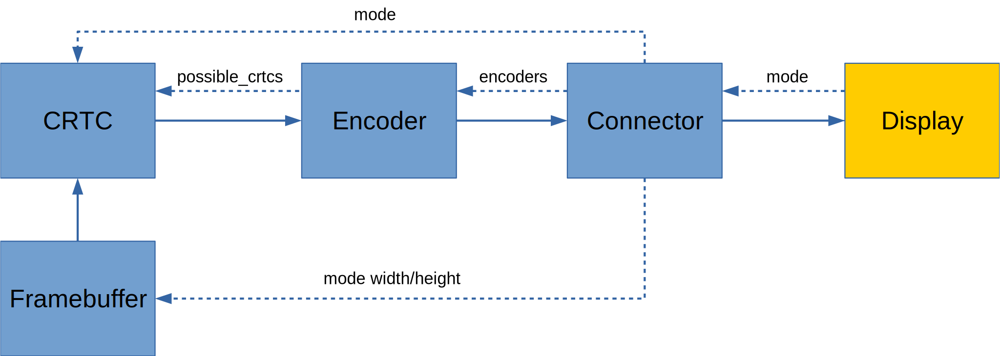

# Writing a DRM application
## Part 2 - Modesetting

Last time, we enumerated our all of the connectors our GPU has, gave it a nice
little name, and printed its modes. It's all pretty easy to grasp.

However, this is where things really step up in difficulty, and we get into the
real meat and potatoes of DRM. We're going to perform a modeset, which is the
process of configuring the DRM pipeline and displaying a frame to the screen.

We have to learn about 3 new types of DRM objects: CRTCs, Encoders, and
Framebuffers. We can't do anything useful without all of them, so we'll
just have to introduce them at the same time.

## Legacy DRM

For this modeset, we're going to perform it using the legacy DRM interface.

> Didn't you say in the first article that we were using the modern APIs?

Yes, I did. However, the modern API, Atomic Modesetting, is still not supported by
every DRM driver, and in the interest of hardware capability, we're going to need
to do it this way. Atomic Modesetting also requires us to use more parts of the DRM
interface we haven't introduced yet.

We're going to get around to Atomic Modesetting in its own article.

## Framebuffers

This DRM object is pretty easy to understand; it's a buffer to store a frame.

```c
typedef struct _drmModeFB {
	uint32_t fb_id;
	uint32_t width, height;
	uint32_t pitch;
	uint32_t bpp;
	uint32_t depth;
	/* driver specific handle */
	uint32_t handle;
} drmModeFB, *drmModeFBPtr;
```

The fields are pretty straight forward:
- `width` and `height` are obvious.
- `pitch` is the number of bytes between different rows in a frame.
This is often called 'stride', as well.
- `bpp` bits per pixel.
- `depth` is the colour depth.
- `handle`, as the comment says: it's a driver specific handle to the framebuffer.
This is different than the handle used for a DRM object.

I brought up the `drmModeFB` struct, but there actually very little reason to
use it directly. We'll just be using its DRM handle and the driver specific
handle for all we need.

I also glossed over `bpp` and `depth`, and whatever the subtle difference there
is between the two.  As it turns out, it's not important: we'll be using DRM
formats instead, which handle all of these kinds of details for us.

## DRM Formats

DRM uses these to describe how the pixels are laid out in your framebuffer.
They're described using [FourCC](https://en.wikipedia.org/wiki/FourCC) codes,
but you can just find a list of them in `/usr/include/libdrm/drm_fourcc.h`.

There are certainly a lot of them there, but that doesn't mean that your
graphics driver supports them.

In fact, the only ones you can use with any degree of confidence are
`DRM_FORMAT_XRGB8888` and `DRM_FORMAT_ARGB8888`.

`XRGB8888` says:
- There are 4 colour components
- The first is ignored and is 8 bits
- The second is red and is 8 bits
- The third is green and is 8 bits
- The fourth is blue and is 8 bits

Similarly, `ARGB8888` says:
- There are 4 colour components
- The first is alpha and is 8 bits
- The second is red and is 8 bits
- The third is green and is 8 bits
- The fourth is blue and is 8 bits

It's helpful to be able to read these descriptions, so we'll do one more
just to drive the point home:

`BGRA1010102` says:
- There are 4 colour components
- The first is blue and is 10 bits
- The second is green and is 10 bits
- The third is red and is 10 bits
- The fourth is alpha and is 2 bits

You'll also notice some oddball ones like `DRM_FORMAT_NV12` and
`DRM_FORMAT_YUYV`. These are multi-planar formats, and don't use the RGB
colour space, and will be covered separately later

It's also important to note that these formats are little endian.  So if we're
using `ARGB8888` and wanted write the colour
[#112233](http://www.color-hex.com/color/112233)[100], in memory, it would look
like
```c
uint8_t pixel[4] = { 0x33, 0x22, 0x11, 0xFF };
```

## CRTCs

After connectors, these are the next most important part of the DRM system.

It stands for **Cathode Ray Tube Controller**.

For those of you who don't remember, CRTs were the display technology used for
old, bulky TVs and Computer monitors, before LCDs completely took over.
However, CRTCs have absolutely nothing to do with Cathode Ray Tubes. The name
is completely meaningless, and is only called that for hysterical raisins.

CRTCs serve as the point for setting framebuffers and controlling our
connectors. They are quite nebulous objects, but most of our interactions with
DRM will end up happening through them.

```c
typedef struct _drmModeCrtc {
	uint32_t crtc_id;
	uint32_t buffer_id; /**< FB id to connect to 0 = disconnect */

	uint32_t x, y; /**< Position on the framebuffer */
	uint32_t width, height;
	int mode_valid;
	drmModeModeInfo mode;

	int gamma_size; /**< Number of gamma stops */

} drmModeCrtc, *drmModeCrtcPtr;
```

- `buffer_id` is the DRM object handle of the framebuffer being used.
- `mode` is the mode currently used on the connector this CRTC is controlling.
- `x`, `y`, `width`, and `height` all show what part of the framebuffer is
actually being shown, meaning we can use a framebuffer larger than mode we're
using.

Despite the fact that the CRTC is controlling a connector, you'll notice that
there is no reference to one here. In fact, it's possible for a CRTC to control
multiple connectors, giving a cloned display, but they must all be running at
the same mode.

## Encoders

Encoders are responsible for taking the pixels from a CRTC, and encoding it into
a format that a particular connector can use.

```c
typedef struct _drmModeEncoder {
	uint32_t encoder_id;
	uint32_t encoder_type;
	uint32_t crtc_id;
	uint32_t possible_crtcs;
	uint32_t possible_clones;
} drmModeEncoder, *drmModeEncoderPtr;
```

You can get the encoders that a connector can use from the `encoders` member of
`drmModeConnector`.

We can ignore most of the members, but the important one for our purpose is
`possible_crtcs`.  This value is a bitmask, and represent which CRTCs found in
`drmModeRes` it is compatible with.

So if bit 0 of `possible_crtcs` is set, it means that this encoder is
compatible with `resources->crtcs[0]`; if bit 1 is set, it's compatible with
`resources->crtcs[1]`; and so on.

## The Pipeline



The solid arrows represent data flows, and the dashed one represents
configuration information.

We're going to keep things sane, and have each CRTC only drive 1 connector each.
We need to keep some extra state for our connectors, so we'll add our own
struct for that.

## Finding a CRTC+Encoder combo

We'll need to loop through each of the encoders for every connector, and try
and find a CRTC which is compatible, and is also not taken.

```c
static uint32_t find_crtc(int drm_fd, drmModeRes *res, drmModeConnector *conn,
		uint32_t *taken_crtcs)
{
	for (int i = 0; i < conn->count_encoders; ++i) {
		drmModeEncoder *enc = drmModeGetEncoder(drm_fd, conn->encoders[i]);
		if (!enc)
			continue;

		for (int i = 0; i < res->count_crtcs; ++i) {
			uint32_t bit = 1 << i;
			// Not compatible
			if ((enc->possible_crtcs & bit) == 0)
				continue;

			// Already taken
			if (*taken_crtcs & bit)
				continue;

			drmModeFreeEncoder(enc);
			*taken_crtcs |= bit;
			return res->crtcs[i];
		}

		drmModeFreeEncoder(enc);
	}

	return 0;
}
```

This solution doesn't actually guarantee us the optimum of the most CRTCs+Encoders
matched, but gives us a decent solution without a lot of work.

For the more computer science savvy readers, matching these CRTCs and Encoders
is an NP-complete, and is an example of the Boolean satisfiability problem. The
problem is small enough that you could just perform an exhaustive search,
though.

## Allocating a Framebuffer

This is kind of a big deal, and is the cause of much contention between the
open source drivers and Nvidia's proprietary driver. There are a lot of
driver-specfic code related to this, but we're going to (sort-of) sidestep that
issue right now, and do the lazy solution.

DRM provides something called a "dumb buffer", which is basically what it
sounds like. It's the bare minimum of what could be provided and provides no
hardware acceleration, but doesn't require anything driver specific. We can
mmap it to userspace, and do software rendering with it, though.

We're eventually going to allocate these properly using libraries like libgbm,
but this article already has way too many difficult new concepts as is.

libdrm doesn't provide wrappers for these, so we'll have to call the ioctls
ourselves. We'll create a wrapper struct for the framebuffer information.
```c
struct dumb_framebuffer {
	uint32_t id;     // DRM object ID
	uint32_t width;
	uint32_t height;
	uint32_t stride;
	uint32_t handle; // driver-specific handle
	uint64_t size;   // size of mapping

	uint8_t *data;   // mmapped data we can write to
};
```
First, we create the buffer and get its driver-specific handle:
```c
struct drm_mode_create_dumb create = {
	.width = width,
	.height = height,
	.bpp = 32,
};

drmIoctl(drm_fd, DRM_IOCTL_MODE_CREATE_DUMB, &create);
fb->handle = create.handle;
fb->stride = create.pitch;
fb->size = create.size;
```
From here, we can create our DRM framebuffer object.
```c
uint32_t handles[4] = { fb->handle };
uint32_t strides[4] = { fb->stride };
uint32_t offsets[4] = { 0 };

drmModeAddFB2(drm_fd, width, height, DRM_FORMAT_XRGB8888,
	handles, strides, offsets, &fb->id, 0);
```
You'll notice that we're using arrays of 4 elements. This is because
drmModeAddFB2 also supports multi-planar formats, which can have up to 4
buffers. We only need the first, so we can just set the others to zero.

Now we have to prepare the buffer for being mmaped.
```c
struct drm_mode_map_dumb map = { .handle = fb->handle };
drmIoctl(drm_fd, DRM_IOCTL_MODE_MAP_DUMB, &map);
```
And finally perform the mmap:
```c
fb->data = mmap(0, fb->size, PROT_READ | PROT_WRITE, MAP_SHARED,
	drm_fd, map.offset);
```
We can now write to the memory, just like any other.

## Performing the Modeset

Now that we have all of the pieces together, now it's as easy as calling
```c
drmModeSetCrtc(drm_fd, conn->crtc_id, conn->fb.id, 0, 0,
	&conn->id, 1, &conn->mode);
```

This will display your framebuffer to the monitor, and we can draw whatever
we want to.

This won't work if we try to run our program inside Xorg or a Wayland
Compositor.  You'll need to change to a new virtual terminal and run it there.

It's also a good idea to save the old CRTC configuration, and restore it
once we're done, otherwise, once our program exits, the virtual terminal
display will be messed up. You can fix it by switching to another virtual
terminal and then back, though.

---

If you ran my example program, you probably noticed that there is horrible
screen tearing. This is because we're running completely unsynchronised
to our monitor's refresh rate, and we're displaying the framebuffer
in a half-drawn state.

Next time, we're going to look at trying to remedy this with double
buffering and drawing on vertical syncs.
