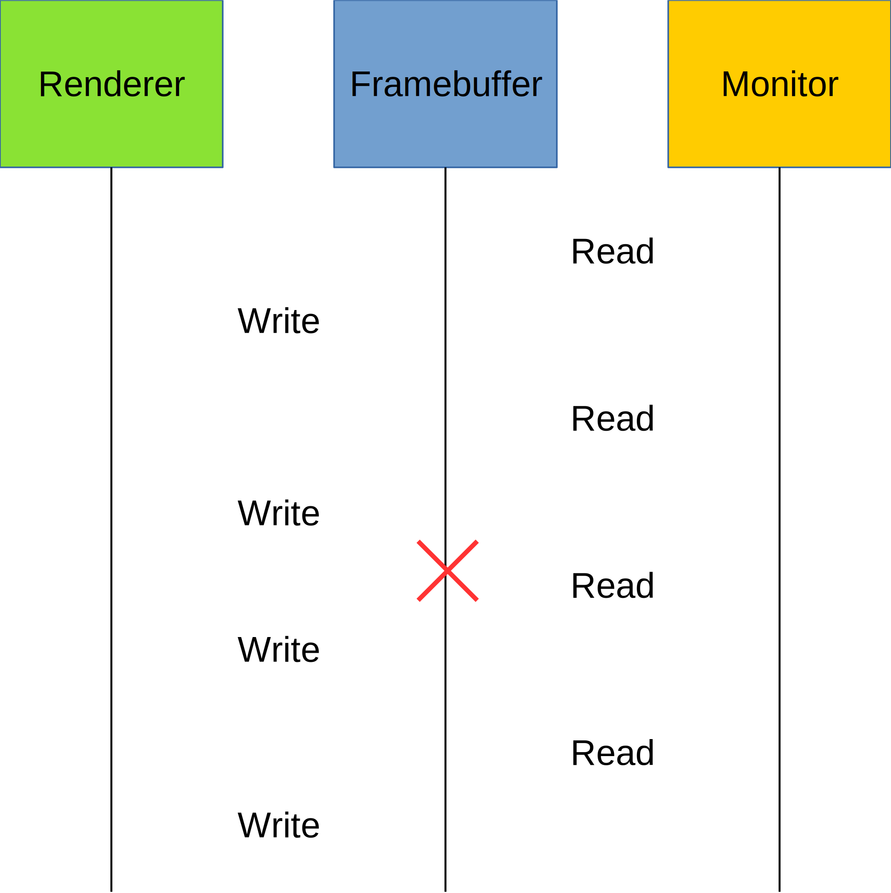

# Writing a DRM application
## Part 3 - Vertical Sync

Last time, we managed to configure the display pipeline with a modeset, and
draw some colours to the screen. However, we had horrible screen tearing.

Just to make sure we're all on the same page, screen tearing is the 'line' you
can see when you're drawing a frame, where you can see part of the new frame,
and part of the old frame. It's especially noticeable with fast motion.


We're going to investigate two different ways people use to combat this:
double buffering and vertical sync.

## Why tearing happens


Your computer monitor will be reading from your framebuffer at very regular
intervals (your refresh rate, in fact). It'll indiscriminately take whatever is
in there at the time it's reading. If we happen to be halfway drawing our
frame, it'll show our half drawn frame, as well as what was left in the
framebuffer before.

So we need to make sure that we're not drawing anything during the period
that the monitor is reading from the framebuffer.

## Double buffering

From the name, it should be obvious what we're going to do: use two buffers.

We have a front buffer and a back buffer. The front buffer is the buffer that
the monitor reads from, and is always in a complete state. The back buffer
is where we perform our rendering.

Once we've finished our frame in the back buffer, we swap the two, so our back
buffer is now being presented to the monitor, and we now start rendering to our
front buffer.

We already have the framebuffer allocation code from the last example, so we
just need to call it again. And once we've finished our frame, we call
drmModeSetCrtc to set it to use the back buffer.

```c
struct dumb_framebuffer *fb = conn->back;

// Draw some stuff!

drmModeSetCrtc(drm_fd, conn->crtc_id, fb->id, 0, 0,
	&conn->id, 1, &conn->mode);

// Swap buffers
conn->back = conn->front;
conn->front = fb;
```

This solution isn't perfect though. If we happen to swap the buffers during
the read period, it can still tear.

## Vertical sync

Going back to using a single buffer; we can look at that sequence diagram
and say

> If we knew when the frame was getting displayed, we could avoid writing
when the monitor is reading.

And DRM provides a way for us to do that.

DRM has as event system that can notify us at certain times during this cycle.
The one we're interested in is the "page flip" event, which happens right after
the read ends.

```c
#define DRM_EVENT_CONTEXT_VERSION 4

typedef struct _drmEventContext {

	/* This struct is versioned so we can add more pointers if we
	 * add more events. */
	int version;

	void (*vblank_handler)(int fd,
			       unsigned int sequence, 
			       unsigned int tv_sec,
			       unsigned int tv_usec,
			       void *user_data);

	void (*page_flip_handler)(int fd,
				  unsigned int sequence,
				  unsigned int tv_sec,
				  unsigned int tv_usec,
				  void *user_data);

	void (*page_flip_handler2)(int fd,
				   unsigned int sequence,
				   unsigned int tv_sec,
				   unsigned int tv_usec,
				   unsigned int crtc_id,
				   void *user_data);

	void (*sequence_handler)(int fd,
				 uint64_t sequence,
				 uint64_t ns,
				 uint64_t user_data);
} drmEventContext, *drmEventContextPtr;

extern int drmHandleEvent(int fd, drmEventContextPtr evctx);
```

This is just a struct of callbacks for the various events. It's also good to
note that when we have an event available, the DRM file descriptor will show
as readable with poll(2) or similar functions.

Now we need to tell DRM that we want an to receive a page flip event.

```c
drmModePageFlip(drm_fd, conn->crtc_id, conn->buf.id, DRM_MODE_PAGE_FLIP_EVENT, conn);
```

The last argument will be passed as `user_data` to the callback.

We can then put all of the draw code into our callback function:
```c
static void page_flip_handler(int drm_fd, unsigned sequence, unsigned tv_sec,
		unsigned tv_usec, void *data)
{
	(void)sequence;
	(void)tv_sec;
	(void)tv_usec;

	struct connector *conn = data;
	struct dumb_framebuffer *fb = &conn->fb;

	// Draw some stuff!

	if (drmModePageFlip(drm_fd, conn->crtc_id, fb->id,
			DRM_MODE_PAGE_FLIP_EVENT, conn) < 0) {
		perror("drmModePageFlip");
	}
}
```

We can only have one page flip active per CRTC at a single time.
We also need to call it again, so we'll receive an event after the next read.

This **may** look better, but it's still not perfect. If we're too slow to render
and miss our "read window" (vblank is the terminology), we'll still see a
partially rendered frame.



You can exacerbate this problem by artificially slowing our program down. For
example, you could run it through valgrind.

## Page Flipping

We've found that the previous two solutions separately don't solve screen tearing.
However, the trick is actually to use both at the same time.

We tried to use `drmModePageFlip`, but we weren't actually using it the way it was
designed for. A "page flip" is actually the way to tell the kernel to use a new
framebuffer after the monitor read ends. We were just telling it to use the buffer
that was already there.

So once we've finished drawing on our back buffer, we want to page flip it.
This will be sure that we never show a partially drawn frame or swap buffers
during the monitor read, and if we're too slow to draw the frame, the front
buffer will remain unchanged.

Running our program through valgrind (just to slow it down), you'll see that
there is no screen tearing.

---

Next time, we'll look at adding hardware acceleration for our rendering.
